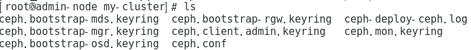
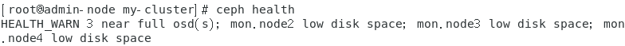
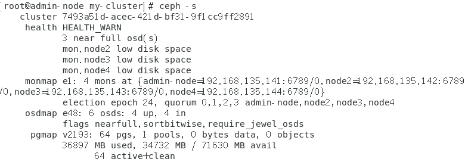
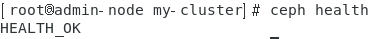
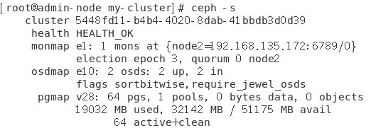

# Ceph的安装和实践

## Ceph的部署

### Ceph的推荐 总共4个node 1作为ceph-deploy 另外三个其中一个作为mon，另外两个作为osd


## CEPH的部署安装

####  **修改yum源** 

```
yum clean all
curl http://mirrors.aliyun.com/repo/Centos-7.repo >/etc/yum.repos.d/CentOS-Base.repo
curl http://mirrors.aliyun.com/repo/epel-7.repo >/etc/yum.repos.d/epel.repo 
sed -i '/aliyuncs/d' /etc/yum.repos.d/CentOS-Base.repo
sed -i '/aliyuncs/d' /etc/yum.repos.d/epel.repo
yum makecache
```

####  增加ceph的源 

```
vim /etc/yum.repos.d/ceph.repo
##内容如下
[ceph]
name=ceph
baseurl=http://mirrors.163.com/ceph/rpm-jewel/el7/x86_64/
gpgcheck=0
[ceph-noarch]
name=cephnoarch
baseurl=http://mirrors.163.com/ceph/rpm-jewel/el7/noarch/
gpgcheck=0
```

####  更新您的存储库并安装`ceph-deploy`： 

```
yum update && sudo yum install ceph-deploy
```

## CEPH节点设置

####  管理节点必须具有对Ceph节点的无密码SSH访问。当ceph-deploy以用户身份登录到Ceph节点时，该特定用户必须具有无密码`sudo`特权。 

#### 我们建议在Ceph节点上（尤其是在Ceph Monitor节点上）安装NTP，以防止时钟漂移引起问题。有关详情，请参见[ntp同步教程!]( https://blog.csdn.net/hellboy0621/article/details/81903091 )

### 安装SSH服务器

#### 对于**所有** Ceph节点，请执行以下步骤：

#### 在每个Ceph节点上安装SSH服务器（如果需要）：

```
sudo yum install openssh-server
```

### 创建一个CEPH部署用户

### 启用无密码

由于`ceph-deploy`不会提示您输入密码，因此您必须在管理节点上生成SSH密钥，并将公用密钥分发给每个Ceph节点。`ceph-deploy`将尝试为初始监视器生成SSH密钥。

1.生成SSH密钥，但不使用`sudo`或 `root`用户。将密码短语留空：

```
ssh - keygen
```

2.将密钥复制到每个Ceph节点的用户名替换。 

```
ssh-copy-id Ceph节点IP
```

## 存储集群快速入门

####  首先，使用一个Ceph Monitor和两个Ceph OSD守护进程创建一个Ceph存储集群。集群达到状态后，通过添加第三个Ceph OSD守护程序，一个元数据服务器和两个以上的Ceph Monitors对其进行扩展。为了获得最佳结果，请在管理节点节点上创建一个目录，以维护为集群生成的配置文件和密钥。`active + clean``ceph-deploy` 

```
mkdir my-cluster
cd my-cluster
```

### 创建群集

####  如果您在任何时候遇到麻烦并且想要重新开始，请执行以下操作清除配置： 

```
ceph-deploy purgedata {ceph-node} [{ceph-node}]
ceph-deploy forgetkeys
```

#### 在您创建的用于保存配置详细信息的目录的管理节点上，使用进行以下步骤`ceph-deploy`。

#### 1.创建集群。

```
ceph-deploy new {initial-monitor-node(s)}
```

####  检查`ceph-deploy`with `ls`和`cat`当前目录中的输出。您应该看到一个Ceph配置文件，一个监视器秘密密钥环和一个新集群的日志文件。有关 更多详细信息 

#### 2.将Ceph配置文件中的默认副本数从更改为 `3`，`2`以便Ceph可以仅使用两个Ceph OSD 来达到一种状态。在该部分下添加以下行：`active + clean``[global]` 

```
osd pool default size = 2
```

#### 3.根据自己的IP配置向ceph.conf中添加public_network，并稍微增大mon之间时差允许范围(默认为0.05s，现改为2s)： 

```
[root@ceph-1 cluster]# echo public_network=192.168.135.0/24 >> ceph.conf
[root@ceph-1 cluster]# echo mon_clock_drift_allowed = 2 >> ceph.conf
[root@ceph-1 cluster]# cat ceph.conf 
[global]
fsid = 4a3e86f0-1511-4ad7-9f69-b435ae16dc28
mon_initial_members = ceph-1, ceph-2, ceph-3
mon_host = 10.39.47.63,10.39.47.64,10.39.47.65
auth_cluster_required = cephx
auth_service_required = cephx
auth_client_required = cephx

public_network=192.168.135.0/24
mon_clock_drift_allowed = 2
```

#### 4.安装Ceph。

```
ceph-deploy install admin-node node2 node3 node4
```

#### 5.添加初始监视器并收集密钥： 

```
ceph-deploy mon create-initial
```


#### ls查看一下！



### OSD操作

#### 1.添加两个OSD。为了快速设置，此快速入门使用每个Ceph OSD守护进程的目录，而不是整个磁盘。有关将单独的磁盘/分区用于OSD和日志的详细信息，请参见ceph-deploy osd。登录到Ceph节点并为Ceph OSD守护程序创建目录。

```
ssh node2
sudo mkdir /var/local/osd0
exit

ssh node3
sudo mkdir /var/local/osd1
exit
```

####  然后，在您的管理节点上，使用`ceph-deploy`来准备OSD。 

```
ceph-deploy osd prepare {ceph-node}:/path/to/directory
```

####  最后，激活OSD。 **激活前先把文件权限调成777！要不然不能创建！**

```
ceph-deploy osd activate {ceph-node}:/path/to/directory
```

####  2.使用`ceph-deploy`配置文件和管理密钥复制到您的管理节点和你的Ceph的节点，以便您可以使用`ceph` CLI，而无需指定监视地址和 `ceph.client.admin.keyring`每次执行命令。 

```
ceph-deploy admin admin-node node1 node2 node3
```

#### 3.确保您具有的正确权限 `ceph.client.admin.keyring` 

```
chmod +r /etc/ceph/ceph.client.admin.keyring
```

#### 4.检查集群的运行状况。 

```
检查集群的运行状况。
```



#### 由于集群创建都是10G安装基本yumwget等已经没有大小，看不出来

#### 所以输入ceph -s查看详情！



#### active+clean没毛病干就好了个屁啊WARN看起来很不爽为了防止我是完美正确的一个男子

#### 于是我又做了三遍，发现好像是应该在**ceph.conf**里面加入

```
osd pool default size = 2
```

#### 防止OSD不在预想中的数量导致不平衡

#### 最后来个硬的 node2作为mon，node3、4作为osd。用了40G存储的虚拟机就真没毛病了！




