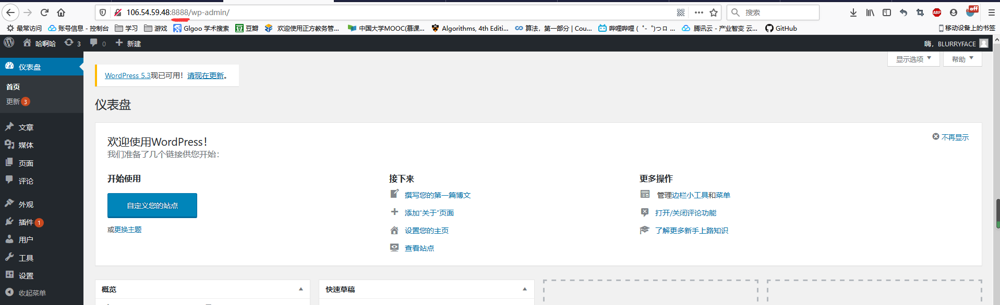
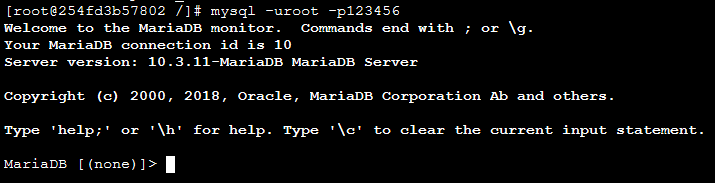

# Docker基础实验（CentOS）

- ### **CentOS7安装Docker**

- ### **拉取CentOS镜像，并基于该镜像运行容器，在容器实例上完 成WordPress的安装，并推送到Docker Hub** 

- ### **利用Dockerfile创建一个完成WordPress安装的镜像并推送 到Docker Hub**


## CentOS7安装Docker

### 要求：CentOS7且内核版本大于等于3.10

### ①安装Docker

#### 先查看**内核**版本

```
uname -r
```


OK!是大于等于3.10的

#### CentOS 7的应用程序库可能不是最新的，因此首先更新应用程序数据库吧

```
yum check-update
```

#### 设置 Docker CE 资源库:  

```
yum install -y yum-utils    
yum-config-manager --add-repo https://download.docker.com/linux/centos/docker-ce.repo
yum makecache fast
```

#### 安装Docker

```
yum -y install docker-ce
```

#### 启动Docker

```
systemctl start docker
```


### ②设置mirror

#### 新版的 Docker 使用 /etc/docker/daemon.json 来配置 Daemon

#### 在该配置文件中加入（没有该文件的话，请先创建一个）：

```
vim /etc/docker/daemon.json
```

 **{      "registry-mirrors": ["https://docker.mirrors.ustc.edu.cn"]    }**


### ③开放管理端口映射

#### 管理端口在 /lib/systemd/system/docker.service 文件中

####     将其中第11行的 ExecStart=/usr/bin/dockerd 替换为：

#####     ExecStart=/usr/bin/dockerd -H tcp://0.0.0.0:2375 -H unix:///var/run/docker.sock -H tcp://0.0.0.0:7654

#####     （此处默认2375为主管理端口，unix:///var/run/docker.sock用于本地管理，7654是备用的端口）

#### 将管理地址写入 /etc/profile 

```
echo 'export DOCKER_HOST=tcp://0.0.0.0:2375' >> /etc/profile
```

####    使profile生效 

```
source /etc/profile
```

### ④启动Docker

```
systemctl daemon-reload && service docker restart
```

### ⑤测试docker

```
docker run hello-world
```


成功！


## 拉取CentOS镜像，并基于该镜像运行容器，在容器实例上完 成WordPress的安装，并推送到Docker Hub 

### Docker加载CentOS7

#### 直接拉取Centos7

```
docker pull centos:7
```

#### 拉完查看下成功否

```
docker images
```

**运行Docker容器（为了方便检测后续wordpress搭建是否成功，需设置端口映射（-p），将容器端口80 
映射到主机端口8888，Apache和MySQL需要 systemctl 管理服务启动，需要加上参数 –privileged 
来增加权，并且不能使用默认的bash，换成 init，否则会提示 Failed to get D-Bus connection: 
Operation not permitted ，-name 容器名  ，命令如下 ）**

```
docker run -d -it --privileged --name wordpress -p 8888:80 -d centos:7 /usr/sbin/init
```

#### 查看已启动的容器

```
docker ps
```


#### 输入以下命令进入容器shell（f14为容器ID，可为简写）

```
docker exec -it f14 /bin/bash
```

变成这样即为成功

#### 你可以在此shell运行任何命令，比如安装Apache Web服务器：

```
yum install httpd
```


### Docker中CentOS7安装WordPress

详见这个链接哈[WordPress安装教程](https://github.com/BLURRYFACEEE/CloudComputing/tree/master/Website)

#### 最后安装完在浏览器输入IP:8888出现这个表示容器安装成功（因为前面端口映射为8888）


#### 出现这个表示安装成功！




### 推送带有WordPress的镜像

#### 先前往[DockerHub网站](https://hub.docker.com/)注册账号（若访问速度慢就进别的网站镜像）

**注册完后将容器生成镜像  (所生成的镜像名由   “Docker用户名/Docker仓库名“组成  ，否则推送会报错： denied: requested access to the resource is denied )**

docker commit -a "Docker用户名" -m "提交描述" 容器id 镜像名:tag标签

```
docker commit -a "1481604320" -m "wordpress on centos7" f1421c82af6c 1481604320/centos:v1
```

**登录Docker**

```
docker login
```

**推送镜像**

```
docker push 镜像名:tag标签
# 举例  docker push 1481604320/centos:v1
```

若出现以下界面即为成功！


## 利用Dockerfile创建一个完成WordPress安装的镜像并推送 到Docker Hub

### **提示：FROM的镜像一定要选好版本，不同版本差别很大！！！**

### ①安装Apache Web服务器

#### 先在CentOS本地创建需要配置Apache Web所需要的文件：

##### ......./apache_centos/run.sh                            ######Dockerfile执行时的运行文件

##### ......./apache_centos/Dockerfile                      ######Dockerfile本身文件

##### ......./apache_centos/sample/index.html      ######apache测试成功与否文件


### 先配置Dockerfile！

FROM centos:7
#设置继承来自centos:7镜像

MAINTAINER WCJS
#创建者的基本信息


ENV DEBIAN_FRONTEND noninteractive

#设置环境变量，所有操作都是非交互式的

RUN echo "Asia/Shanghai" > /etc/timezone #&& \

dpkg-reconfigure -f noninteractive tzdata      #这也是设置时区的

#注意这里要更改系统的时区设置，因为在Web应用中经常会用到时区这个系统变量，默认的centos会让你的应用此程序发生不可思议的效果哦

#安装wget
RUN yum -y update
RUN yum install -y wget
WORKDIR /usr/local/src

#下载并解压源码包
RUN wget https://mirrors.tuna.tsinghua.edu.cn/apache//httpd/httpd-2.4.41.tar.gz           

#这里下载的是httpd-2.4.41版本的
RUN tar -xf httpd-2.4.41.tar.gz
WORKDIR httpd-2.4.41

#编译安装apache
RUN yum install -y gcc make apr-devel apr apr-util apr-util-devel pcre-devel
RUN ./configure --prefix=/usr/local/apache2 --enable-mods-shared=most --enable-so
RUN make
RUN make install

#修改apache配置文件
RUN sed -i 's/#ServerName www.example.com:80/ServerName localhost:80/g' /usr/local/apache2/conf/httpd.conf

#启动apache服务
RUN /usr/local/apache2/bin/httpd

#复制服务启动脚本并设置权限
ADD run.sh /usr/local/sbin/run.sh
RUN chmod 755 /usr/local/sbin/run.sh

#添加一个示例的Web站点，删除默认安装在apache文件夹下面的文件，并将我们添加的实例用软链接到/var/www/html目录下面
RUN mkdir -p /app && rm -fr /usr/local/apache2/html && ln -s /app /usr/local/apache2/html
COPY sample/ /app

#开放80端口
EXPOSE 80

切换到/app

WORKDIR /app
CMD ["/usr/local/sbin/run.sh"]

#这里的CMD执行的是容器里面的run.sh的路径

-------------------------------------------------------------------------------------------------------------------------------------------------------

####  使用docker build命令创建centos:apache镜像，注意命令最后的"."。 

```
 docker build -t centos:apache . 
```


发现已经有了！

#### 最后运行这个镜像变成一个容器

#### 名字叫做centos_apache20191117

#### 8080作为80端口的映射，将测试网页的路径/opt/apache_centos/sample映射到apache网页的路径/usr/local/apache2/htdocs/

```
docker run -dit --name centos_apache20191117 -p 8080:80 -v /opt/apache_centos/sample/:/usr/local/apache2/htdocs/ centos:apache
```

docker ps看一下结果！


#### 最后在浏览器输入IP:8080查看！


成功！

### ②安装MySQL

真滴恐怖！！！！把我搞傻了，想要安装，发现大多数指令都是centos6环境下的，用是可以用，但都centos7了，centos7环境下指令要不然不全要不然有错，最后还要自己改。。。

#### 首先先编写Dockerfile

#### 我在路径/opt/mysql_centos/test下创建nano Dockerfile

```
FROM centos:7
MAINTAINER ZSG
#yum下载mariadb的相关程序
RUN yum -y install mariadb-server openssh-server -y && yum clean all
#赋予权限给mariadb
RUN mysql_install_db --force&& chown -R mysql:mysql /var/lib/mysql/
#将主机响应文件传到容器
VOLUME /var/lib/mysql/
ADD mysql.sh /mysql.sh
RUN chmod 755 /mysql.sh
EXPOSE 22
EXPOSE 3306
CMD ["/mysql.sh"]
```

#### 编写 mysql.sh 脚本内容 

```
#!/bin/bash 
#Author:ZSG
mysqld_safe &
sleep 5
mysqladmin -uroot password '123456'
mysql -uroot -p123456 -e "GRANT ALL ON *.* TO 'root'@'%' IDENTIFIED BY '123456';FLUSH PRIVILEGES;"
sed -i 's/UsePAM yes/UsePAM no/g' /etc/ssh/sshd_config && ssh-keygen -t rsa -f /etc/ssh/ssh_host_rsa_key
echo 123456 | passwd --stdin root
/usr/sbin/sshd -D
```


#### 构造以CentOS7为基础的image名为centos:mariadb

```
docker build -f Dockerfile -t centos:mariadb .
```

#### 在centos:mariadb镜像的基础上运行叫做centos_mariadb20191117的容器端口映射200002到22（宿主主机）

```
docker run -d -p 20002:22 --name centos_mariadb20191117 centos:mariadb
```

#### 登录

```
mysql -uroot -p123456
```

若出现以下画面即成功！



### ③安装PHP

#### 编写Dockerfile！我放在/opt/cnetos_php下面

```
FROM centos:7
MAINTAINER ZSG
RUN rpm -Uvh https://mirror.webtatic.com/yum/el7/epel-release.rpm
RUN rpm -Uvh https://mirror.webtatic.com/yum/el7/webtatic-release.rpm
#RUN rm -rf /etc/yum.repos.d/*
#RUN echo -e "[yum]\nname = yum\ngpgcheck = 0\nbaseurl = http://192.168.2.11:8000" > /etc/yum.repos.d/yum.repo
RUN yum install httpd php70w php70w-mysql php70w-mbstring -y && yum clean all
EXPOSE 80
CMD ["/usr/sbin/httpd","-f","/etc/httpd/conf/httpd.conf","-DFOREGROUND"]
```

#### 运行一个在centos:7镜像基础上名为centos:php的镜像

```
 docker build -f Dockerfile -t centos:php .
```

#### 运行在centos:php镜像基础上的容器名为centos_php20191117，端口映射8889

```
docker run -d -p 8889:80 -v /myweb/:/var/www/html/ --name centos_php20191117 centos:php
```

为了测试是否成功

按老文章中创建界面最后输入IP:端口号/info.php

若出现一下画面即成功！


### ④安装WordPres

#### 这边我们有两个方法

#### (1)将前面单独创建好的centos_mariadb容器和centos_php容器通过link进行连接

#### (2)将前面安装Dockerfile进行统一创建容器

### 方法(1)将前面单独创建好的centos_mariadb容器和centos_php容器通过link进行连接

##### 将前面创建的centos_mariadb容器和centos_php进行连接,并将WordPress的文件路径挂载到WordPress网页的路径


```
docker run -d -p 8889:80 -v /myweb/:/var/www/html/ --link=centos_mariadb20191117:tocentos_mariadb20191117 --name=centos_php20191117 centos:php
```

### 登录进centos_mariadb的容器中创建WordPress所需要的数据库

```
mysql -uroot -p123456
```

```
CREATE DATABASE wordpress;
```

```
GRANT ALL ON wordpress.* TO 'wordpress'@'%' IDENTIFIED BY 'wordpress';
```

```
FLUSH PRIVILEGES;
```

####  安装wordpress web程序 

```
cp -a /root/wordpress/* /myweb/
```

##### 创建一个wp-config.php来激活配置！

```
<?php
/**
 * The base configuration for WordPress
 *
 * The wp-config.php creation script uses this file during the
 * installation. You don't have to use the web site, you can
 * copy this file to "wp-config.php" and fill in the values.
 *
 * This file contains the following configurations:
 *
 * * MySQL settings
 * * Secret keys
 * * Database table prefix
 * * ABSPATH
 *
 * @link https://codex.wordpress.org/Editing_wp-config.php
 *
 * @package WordPress
 */

// ** MySQL settings - You can get this info from your web host ** //
/** The name of the database for WordPress */
define( 'DB_NAME', 'wordpress' );

/** MySQL database username */
define( 'DB_USER', 'wordpress' );

/** MySQL database password */
define( 'DB_PASSWORD', 'wordpress' );

/** MySQL hostname */
define( 'DB_HOST', 'centos_mariadb20191117' );

/** Database Charset to use in creating database tables. */
define( 'DB_CHARSET', 'utf8mb4' );

/** The Database Collate type. Don't change this if in doubt. */
define( 'DB_COLLATE', '' );

/**#@+
 * Authentication Unique Keys and Salts.
 *
 * Change these to different unique phrases!
 * You can generate these using the {@link https://api.wordpress.org/secret-key/1.1/salt/ WordPress.org secret-key service}
 * You can change these at any point in time to invalidate all existing cookies. This will force all users to have to log in again.
 *
 * @since 2.6.0
 */
define( 'AUTH_KEY',         '{#$%(b#6t_zAMMrKvw-:,sGwQjH7K#C?]iTfCm>^ng=IAVcI#O,dxQ}Pw9ZWo07C' );
define( 'SECURE_AUTH_KEY',  '*|f<!U~x]s)d1iYn/+vy4iWrUx0fK:dNKU;#Kr*P`P^2WlM. -OiL`[+Obx~JLk^' );
define( 'LOGGED_IN_KEY',    '!&Z$FIiT8Vyv>B2._[+ZIxL<sNcho?vk q+-2`/A^B[92|G .aXfu(;w]4[K2q/O' );
define( 'NONCE_KEY',        'sN>+K=5&JoMzc$(^HY^GpxOAC?z!,?L<WlftZ<x4DDQ:Ab.{Yj_:iaXa~ijC,OO(' );
define( 'AUTH_SALT',        '5jdo%bOme$+sqhtD{xs5 >|IJ[L`mvV_68W*7x@kcR#QOm.N%( RzjO$Y_7<N+o@' );
define( 'SECURE_AUTH_SALT', '%PI/6zF]z]b8z+wqe-Ub01&Q;E,XdBGacM4&;(h_R]} Pag^wLJ7fv`E]gF}P7LV' );
define( 'LOGGED_IN_SALT',   'OJ {$C&Z; w3w8u<VIs~g~nGU:!8&bPmRA1jyxJKe-r5.&Q2CBn`I3]fyA1^{5uV' );
define( 'NONCE_SALT',       '-wT=R*t<j:!mLT#]|(-ZM*=19V(1,D9UxLph7bzvddRJb,T96}|WKF!O@~<>1k+L' );

/**#@-*/

/**
 * WordPress Database Table prefix.
 *
 * You can have multiple installations in one database if you give each
 * a unique prefix. Only numbers, letters, and underscores please!
 */
$table_prefix = 'wp_';

/**
 * For developers: WordPress debugging mode.
 *
 * Change this to true to enable the display of notices during development.
 * It is strongly recommended that plugin and theme developers use WP_DEBUG
 * in their development environments.
 *
 * For information on other constants that can be used for debugging,
 * visit the Codex.
 *
 * @link https://codex.wordpress.org/Debugging_in_WordPress
 */
define( 'WP_DEBUG', false );

/* That's all, stop editing! Happy publishing. */

/** Absolute path to the WordPress directory. */
if ( ! defined( 'ABSPATH' ) ) {
        define( 'ABSPATH', dirname( __FILE__ ) . '/' );
}

/** Sets up WordPress vars and included files. */
require_once( ABSPATH . 'wp-settings.php' );
```

##### 浏览器输入IP:8889进入WORDPRESS页面！

前面设置的前三个都为wordpress


#### 提交完之后，输入完点击创建！


#### 成功！


# 感天动地！


### 方法(2)将前面Dockerfile进行统一并且改变shell脚本文件mysql.sh来创建容器centos_wdps

#### Dockerfile

```
FROM centos:7
MAINTAINER ZSG
RUN yum -y install mariadb-server openssh-server && yum clean all
#RUN sed -i '$a\127.0.0.1 localhost' /etc/hosts
RUN mysql_install_db --force&& chown -R mysql:mysql /var/lib/mysql/
VOLUME /var/lib/mysql/
ADD mysql.sh /mysql.sh
RUN chmod 755 /mysql.sh
EXPOSE 22
EXPOSE 3306
RUN rpm -Uvh https://mirror.webtatic.com/yum/el7/epel-release.rpm
RUN rpm -Uvh https://mirror.webtatic.com/yum/el7/webtatic-release.rpm
#RUN rm -rf /etc/yum.repos.d/*
#RUN echo -e "[yum]\nname = yum\ngpgcheck = 0\nbaseurl = http://192.168.2.11:8000" > /etc/yum.repos.d/yum.repo
#RUN yum -y install wget && wget -O /etc/yum.repos.d/CentOS-Base.repo http://mirrors.aliyun.com/repo/Centos-7.repo
#RUN yum clean all && yum makecache
RUN yum install httpd php70w php70w-mysql php70w-mbstring -y && yum clean all
EXPOSE 80
#CMD nohup sh -c '/mysql.sh && /usr/sbin/httpd","-f","/etc/httpd/conf/httpd.conf","-DFOREGROUND'
#CMD ["/usr/sbin/httpd","-f","/etc/httpd/conf/httpd.conf","-DFOREGROUND"]
CMD ["/mysql.sh"]
```


#### mysql.sh

```
#!/bin/bash
Author:ZSG
mysqld_safe &
sleep 5
mysqladmin -uroot password '123456'
mysql -uroot -p123456 -e "GRANT ALL ON *.* TO 'root'@'%' IDENTIFIED BY '123456';FLUSH PRIVILEGES;"
sed -i 's/UsePAM yes/UsePAM no/g' /etc/ssh/sshd_config && ssh-keygen -t rsa -f /etc/ssh/ssh_host_rsa_key
echo 123456 | passwd --stdin root
/usr/sbin/httpd -f /etc/httpd/conf/httpd.conf -DFOREGROUND
/usr/sbin/sshd -D
```


#### 输入创建镜像centos:wdps

```
docker build -f Dockerfile -t centos:wdps .
```


#### 然后运行创建容器也要有改动

```
docker run -d -p 8889:80 -p 20003:22 -v /myweb/:/var/www/html/ --name centos_wdps centos:wdps
```

#### 利用两个-p来进行两个端口映射！一个是php一个是数据库！名字叫centos_wdps容器


#### 登录进centos_wdps这个容器中创建WordPress所需要的数据库

```
mysql -uroot -p123456
```

```
CREATE DATABASE HEHE;
```

```
GRANT ALL ON ZSG.* TO 'HEHE'@'%';
```

```
FLUSH PRIVILEGES;
```

#### 浏览器输入IP:8889进入WORDPRESS页面！

#### 这里使用root用户登录访问WordPress数据库


# 登录成功！


#### 到此两种方法装WordPress都完成了！

真滴恐怖，，，网络上大多数的代码要不然就是太早的yum下载到的也是太早的，各个组件版本不一样又会冲突！？！？！？不过最终翻过这个高山，你就会看到河流！穿越这片丛林，你就会看到彩虹！智商不够，抓紧学习！

