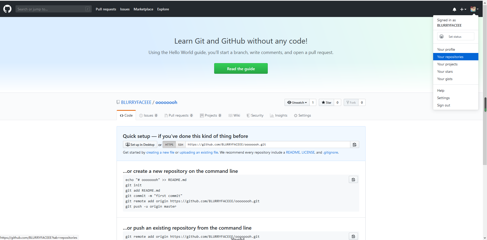

1. 购买腾讯云服务器（学生）并登录（webshell和xshell）
2. 创建GitHub项目并在本地同步
3. 本地安装VMware Workstation和CentOS操作系统

# 购买腾讯云服务器（学生）并登录

具体操作流程如下！

## 购买腾讯云服务器

点击腾讯云服务器链接进入购买界面，注意选择**活动地域**和**操作系统**

[腾讯云学生链接](https://cloud.tencent.com/act/campus?fromSource=gwzcw.2432687.2432687.2432687&utm_medium=cpc&utm_id=gwzcw.2432687.2432687.2432687)


## 登录

### Web shell登录（网页）

购买成功后进入**实例**界面，发现已经有了主机，点击右侧登录微信扫码后即可


进入登录界面若需要密码且忘记密码即可在**更多**选项中重置密码登录


若想用**秘钥**登录→[秘钥教程](https://blog.csdn.net/snsdzjlz/article/details/51142684#commentBox)

出现以下界面即为成功！


### xshell登录

下载地址→ [xshell官方](https://xshell.en.softonic.com/)

下载完后一波安装

点击**新建**


**名称**随便

**主机**填**公网IP**地址

**登录名**若没有设置就是root

**密码**输入在腾讯云上面设置的密码

出现下面界面就连接成功了！！


# 创建GitHub项目并在本地同步

## 创建GitHub账户

官网→ [GitHub](https://github.com/)

在这**窗口**直接注册账户即可


登录进去后不要慌张！！！首先我们县要创建一个网上资源库，**点击右上角＋New repository**


名字和README的增加自由发挥


创建成功后界面别关！

## 本地同步

开始下载**git**→ [Git官网](https://git-scm.com/downloads)

一路无非nextnextnext

完成安装后打开**Git Bash**进入操作页面


那如何将本地和GitHub上同步呢？要经过以下步骤

### 1.创建ssh key

输入以下代码生成**.ssh**

```git
$ ssh-keygen-t rsa-C "自己的邮箱（改）"
```

一路无非回车回车

.ssh一般是在这个默认路径下


打开文件夹后用记事本方式打开**id_rsa**里面有秘钥并复制！


打开原来没关的GitHub页面点击右上角的**酷炫头像**，点击**Settings**后选择**SSH keys GPG keys**，增加秘钥把刚刚复制的粘贴上去！


即通过秘钥建立了本地和GitHub的连接

输入以下命令同步下名字和邮箱

```
git config --global usr.name"输入名字（修改）"

git config --global usr.email"输入邮箱（修改）"
```

### 2.创建本地仓库

输入完后进入GitHub主页点击右边**Your repositories**选择我们刚刚创建的仓库，有出现链接，复制该链接



现在你喜欢的地方创建一个文件夹，在**git bash**中定位你想要的创建本地仓库的位置（通过cd定位）


输入

```git
git clone 刚刚复制的网址
```

之后就会发现从GitHub上同步下来的仓库


###### 以后想要上传都要先从GitHub上先创建，clone后，再添加自己的文件上传到GitHub上即可！

### 3.上传文件（以后都一样）

随便创建个东西

输入   ------------↓(你想要上传的路径)like .或..

```
git add test.txt
```

（双引号内为备注）↓

```
git commit -m "cc"
```

```
git push origin master
```

#### **上传时一定要先cd（转到）到已同步的仓库（文件夹）中！！**

# 本地安装VMware Workstation和CentOS操作系统

## 安装VMware Workstation

官网链接→  [player免费版](https://my.vmware.com/cn/web/vmware/free#desktop_end_user_computing/vmware_workstation_player/15_0)

下载完后安装 一路无非nextnextnext

## 下载centos

官网链接→ [centos](https://www.centos.org/download/)

下载完.iso文件后打开VMware

按照这→ [详细教程](https://blog.csdn.net/babyxue/article/details/80970526)进行安装！

安装完后启动！

<u>非常重要一点！刚进入页面用户名填入root或自己创建的，**密码**一定要注意要先开启小键盘！因为看不见所以不知道情况一直进不去！</u>


出现以下画面即为成功！


# 感谢！