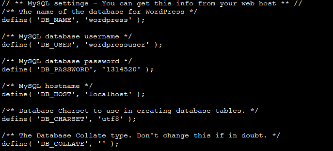

# 搭建个人网站

## 使用wordpress

- 云操作系统：CentOS 7.2 64位；
- HTTP服务器：Apache Web 服务器；
- 数据库：MySQL；
- 建站工具：WordPress（基于PHP）。

### 1.安装Apache Web服务器

使用yum工具安装：

```
sudo yum install httpd
```

sudo命令获得了root用户的执行权限，因此需要验证用户口令。
安装完成之后，启动Apache Web服务器：

```
sudo systemctl start httpd.service
```

测试Apache服务器是否成功运行，找到腾讯云实例的公有IP地址(your_cvm_ip)，在你本地主机的浏览器上输入：

```
http://your_cvm_ip/
```

出现以下界面（全部安装）


或出现以下界面（初安装）


### 2.安装MySQL

用yum直接安装mysql

```
sudo yum install mariadb-server mariadb
```

启动mariadb

```
sudo systemctl start mariadb
```

```
sudo mysql_secure_installation
```

最后设置开机启动MariaDB

```
sudo systemctl enable mariadb.service
```

### 3.安装PHP

用yum安装PHP

```
sudo yum install epel-release yum-utils
sudo yum install http://rpms.remirepo.net/enterprise/remi-release-7.rpm
```

启用 PHP7.2Remi

```
sudo yum-config-manager --enable remi-php72
```

安装PHP以及php-mysql

```
sudo yum install php php-mysql
```

输入查看php版本

```
php -v
```

安装之后，重启Apache服务器以支持PHP

```
sudo systemctl restart httpd.service
```

为了更好的运行PHP，需要启动PHP附加模块，使用如下命令可以查看可用模块

```
yum search php-
```

### 4.测试PHP

出现以下即为成功！！


## 5.安装WordPress以及完成相关配置

### (1)为WordPress创建一个MySQL数据库

登录mysql


### (2)安装WordPress

### (3)配置WordPress

已经配好了！



### (4)通过Web界面进一步配置WordPress

最后配置完就是这样！


